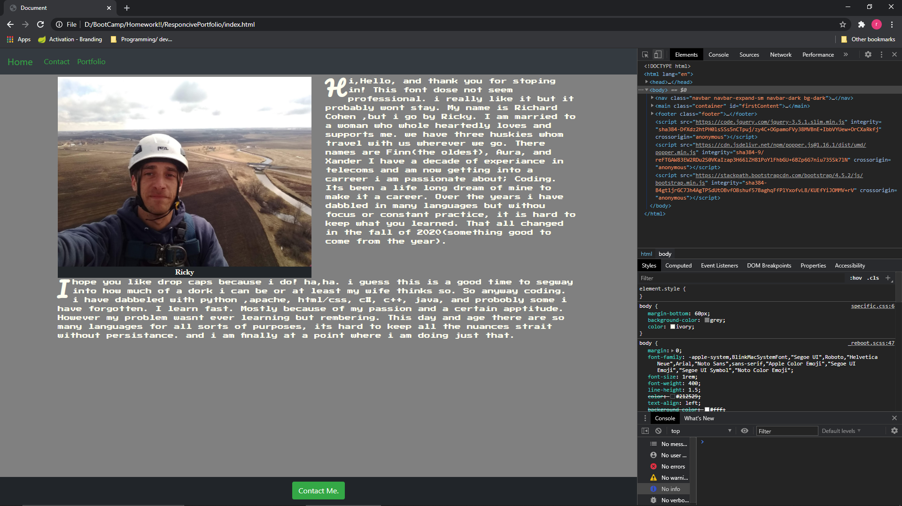
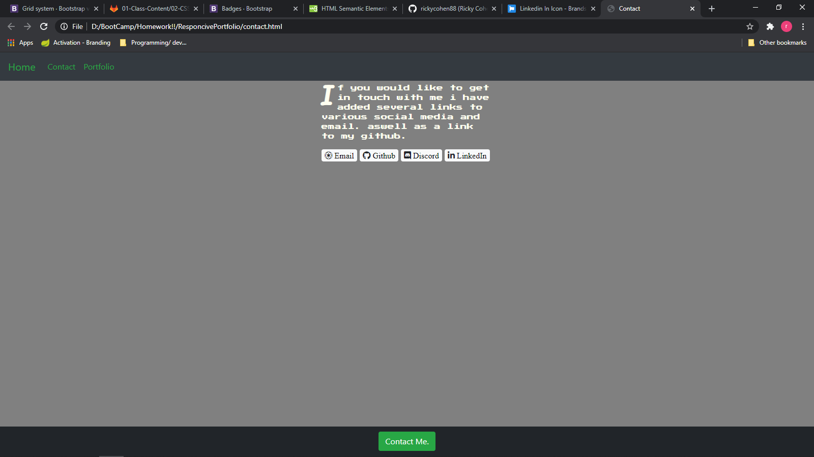
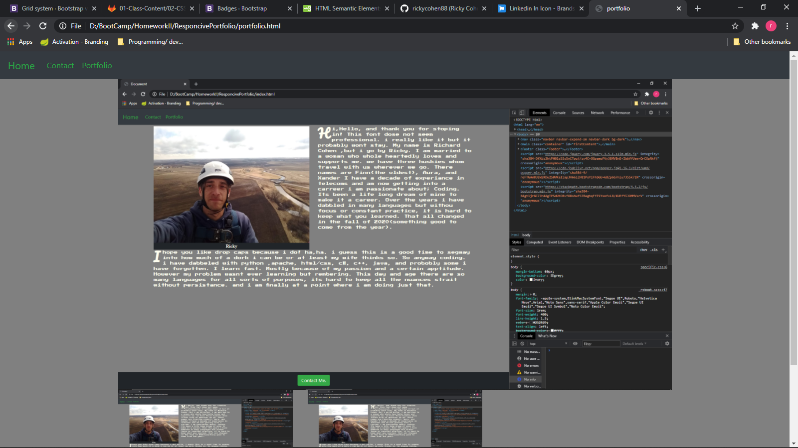

# ResponcivePortfolio

## *Objective* 
to create a Responcive portfolio using as little(i used none) media queries as possible
 `bonus` make a sticky footer(done)
 `bonus` use sub rows and columns on portfolio page(check) 

### Method
Using Bootstrap created a multipage portfollio with assorted layout styles and techniques. added some personalizing of the elements with my own css. added some googlw fonts and some font awesome fonts for button/links.

### Badges
 
 
 

### Usage 
This page could be used as a starting place for making a Portfolio
or if you feel like showing mine off i wouldnt complain.

### Instalation
To make the project work you will need -
* an editor or ide that will save file in the proper types*(html,css,javascript)*  
`Visual Studio or Visual Studio Code` will work great.
* using a version control system you can fork and clone my repo, you could also 
just download the files directly for git hub.

### Deployed website and screenshots

[Link](https://rickycohen88.github.io/ResponcivePortfolio/)

### Credits
* Trillogy Education
* Bootstrap
* Google
* Awesome Fonts

   